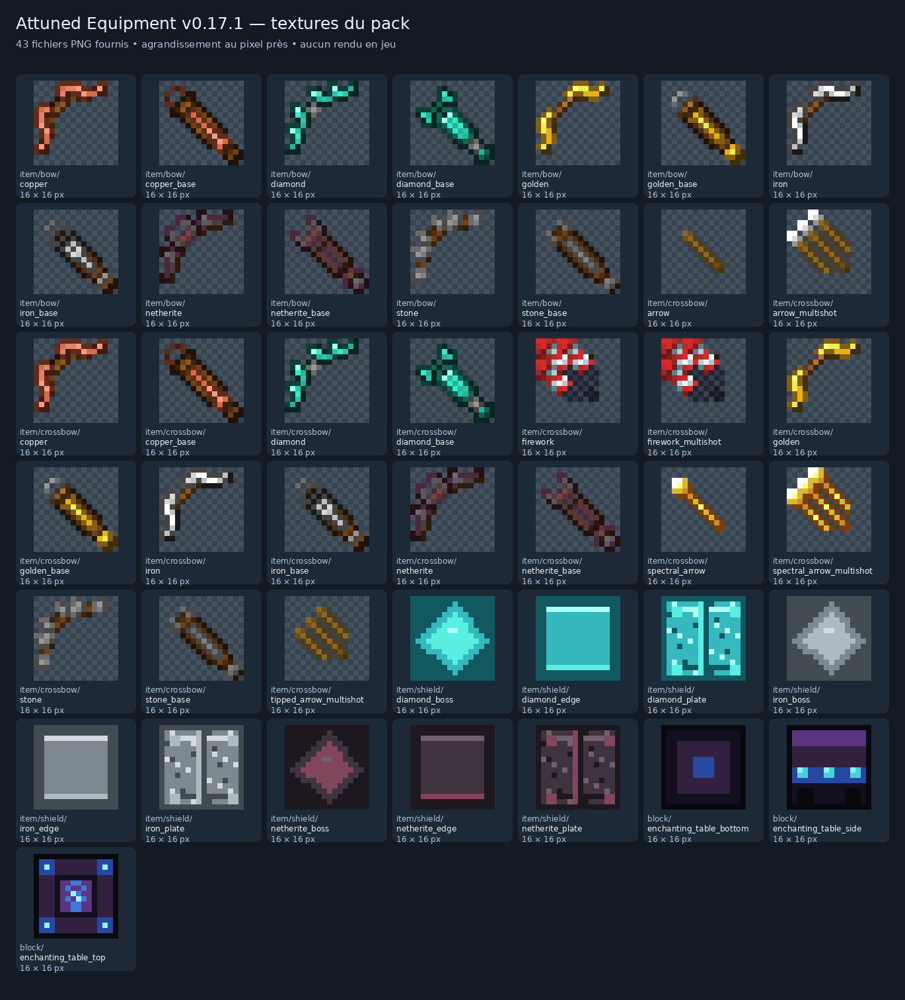

[Accueil du wiki](Home.md) · [Sommaire du dépôt](../README.md) · [Annexes](../ANNEXES.md)

# Pack de ressources

Le pack de ressources **Attuned Equipment RP v0.17.1** apporte l’apparence des arcs, arbalètes et boucliers renforcés, l’habillage de l’enclume et de la table d’enchantement, ainsi que les textes en français et en anglais. Le datapack contient une copie de ce pack sous le nom `resources.zip`.

## Installation

1. Ouvrir le ZIP du datapack et récupérer le fichier `resources.zip`.
2. Placer cette copie dans le dossier `resourcepacks` du client Minecraft. On peut lui donner un nom explicite, par exemple `Attuned_Equipment_RP_1.21.x_v0.17.1.zip`.
3. Activer le pack dans **Options → Packs de ressources**.
4. Sur un serveur, fournir le même pack à chaque joueur.

La présence de `resources.zip` à l’intérieur du datapack **ne l’active pas automatiquement sur le client**. Le pack de ressources et le datapack remplissent deux fonctions différentes : les règles de jeu viennent du datapack ; les modèles, textures et traductions viennent du pack de ressources.

Le français et l’anglais suivent la langue choisie dans Minecraft. Les nouveaux textes du datapack prévoient une version anglaise de secours lorsque le pack de ressources manque. Pour bénéficier de l’affichage prévu, activer les deux packs de la même version.

**Source dans l’archive :** `INSTALLATION_v0.17.1.txt`, lignes 4–7 et 19–20.

## Contenu visuel

L’inventaire du RP comprend **17 définitions d’objets, 68 fichiers de modèles Attuned et 43 textures PNG**. Les modèles incluent des états d’utilisation ; ils ne correspondent donc pas à 68 objets différents.

| Famille | Variantes | Définitions d’objets | Fichiers de modèles | Apparence prévue par les fichiers |
| --- | --- | ---: | ---: | --- |
| Arcs | Pierre, cuivre, fer, or, diamant, netherite | 6 | 24 | Un modèle de base et trois états de tension par matériau |
| Arbalètes | Pierre, cuivre, fer, or, diamant, netherite | 6 | 36 | Base, trois états de chargement, flèche chargée et fusée chargée |
| Boucliers | Fer, diamant, netherite | 3 | 6 | Position normale et position de blocage |
| Catalyseurs d’enclume | Lapis et bloc de lapis | 2 | 2 | Réutilisation des ressources vanilla du lapis |

Les arcs et arbalètes utilisent des modèles d’objets plats fondés sur `minecraft:item/generated`. Les boucliers possèdent une géométrie composée de plusieurs volumes et trois textures par matériau : plaque, bordure et bosse centrale.

Le RP ne contient aucun fichier d’apparence d’armure dans `assets/*/equipment/`, aucune texture d’armure portée et aucun modèle Attuned propre aux épées, pioches, haches, pelles ou houes. L’évolution de ces équipements repose sur leurs objets de base et sur les données du datapack ; il ne faut pas leur attribuer des textures personnalisées absentes de l’archive.

**Sources dans le RP :** `assets/attuned/items/`, `assets/attuned/models/item/`, `assets/attuned/textures/item/`. Les détails chiffrés proviennent du contrôle statique décrit dans [Audit technique](Audit-technique.md).

### Apparence des blocs vanilla

Le fichier `assets/minecraft/models/block/template_anvil.json` remplace le modèle de base de l’enclume et lui donne un socle utilisant la texture vanilla du bloc de diamant. Cette modification vise le modèle vanilla partagé : elle n’est pas réservée, par elle-même, aux stations déjà converties par le datapack.

Trois textures remplacent également le dessous, les côtés et le dessus de la table d’enchantement. Elles sont présentes dans `assets/minecraft/textures/block/enchanting_table_*.png`.

Les fichiers `assets/minecraft/lang/en_us.json` et `fr_fr.json` remplacent chacun le nom de la table d’enchantement par son nom Attuned. Ces deux petits fichiers sont distincts des dictionnaires Attuned complets.

## Planche des textures fournies

Cette planche montre les **43 fichiers PNG originaux**, agrandis sans interpolation. Certaines images sont des couches destinées à être superposées ou appliquées à une géométrie. Il s’agit d’un inventaire visuel des fichiers, pas de captures prises dans Minecraft.

Toutes les textures mesurent **16 × 16 pixels**. Leur répartition est la suivante :

| Dossier | PNG | Rôle |
| --- | ---: | --- |
| `assets/attuned/textures/item/bow/` | 12 | Six variantes et six fichiers portant le suffixe `_base` |
| `assets/attuned/textures/item/crossbow/` | 19 | Couches des six matériaux et sept images liées aux projectiles |
| `assets/attuned/textures/item/shield/` | 9 | Trois textures pour chacun des trois boucliers |
| `assets/minecraft/textures/block/` | 3 | Table d’enchantement |

## Langues

Les dictionnaires Attuned contiennent **1 469 clés chacun**. Les variantes régionales sont actuellement des copies exactes au sein de chaque langue.

| Langue | Codes inclus | Contenu |
| --- | --- | --- |
| Français | `fr_fr`, `fr_ca` | Deux dictionnaires identiques |
| Anglais | `en_us`, `en_gb`, `en_ca`, `en_au`, `en_nz` | Cinq dictionnaires identiques |

Les clés couvrent les interfaces, les messages, les enchantements, des noms d’objets et les noms et récits des reliques. Le contrôle statique a retrouvé **1 445 clés Attuned utilisées littéralement dans des composants `translate` du datapack** : elles existent toutes dans les dictionnaires français et anglais. Aucun dictionnaire ne présente de clé manquante par rapport à `en_us`, de valeur vide ou de valeur d’un autre type qu’une chaîne de texte. Cela vérifie la présence des traductions, sans constituer une relecture linguistique exhaustive de tous les textes.

Les anciens textes Attuned reconnus sont convertis automatiquement dans l’inventaire, la main secondaire et les emplacements d’armure. La notice annonce environ huit secondes pour un passage complet à 20 TPS. Un objet conservé dans un coffre doit être sorti pour passer dans ce mécanisme. Les noms personnels non reconnus sont conservés.

**Sources :** `assets/attuned/lang/*.json` dans le RP ; `INSTALLATION_v0.17.1.txt`, ligne 7, et `data/attuned/function/localization/` dans le DP.

## Modèles anciens et modèles récents

Le RP sélectionne deux mécanismes selon la version du jeu :

| Versions Java | Mécanisme |
| --- | --- |
| 1.21 à 1.21.3 | `overlay_legacy`, avec des variantes de modèles vanilla déclenchées par un nombre `custom_model_data` |
| 1.21.4 à 1.21.11 | Définitions `assets/attuned/items/` sélectionnées par `minecraft:item_model` |

Dans l’overlay ancien, six modèles vanilla sont remplacés : `bow`, `crossbow`, `shield`, `knowledge_book`, `lapis_lazuli` et `lapis_block`. Le livre de connaissances sert notamment de support à dix icônes vanilla de l’interface. Les formats sont décrits dans [Compatibilité](Compatibilite.md).

### Limites visuelles de cette version

Les fichiers déclarent bien plusieurs états de tension pour les arcs et arbalètes. Cependant, pour chacun des six matériaux de chaque famille, le modèle de base et les trois fichiers `_pulling_0`, `_pulling_1`, `_pulling_2` ont actuellement **le même contenu JSON**. Leur sélection ne crée donc pas, à elle seule, une déformation différente de l’arme. L’animation vanilla de la main et le rendu final demandent encore une vérification dans le client.

Onze textures Attuned n’ont pas de référence directe dans les JSON fournis : les six textures `bow/*_base.png` et cinq images d’arbalète liées au tir multiple ou aux flèches spectrales. Leur présence ne prouve pas que l’effet visuel correspondant est affiché. Les états chargés standard de l’arbalète utilisent en revanche les images de flèche et de fusée ordinaires.

Les vérifications statiques résolvent toutes les références locales de modèles et de textures analysées. Elles ne remplacent pas une inspection du rendu en jeu, en main principale, en main secondaire, dans l’inventaire et pendant l’utilisation.

## Association avec d’autres packs de ressources

Un autre pack peut remplacer les mêmes fichiers vanilla, notamment le modèle d’enclume, les textures de table d’enchantement et les six modèles de l’overlay ancien. L’ordre des packs influence alors le résultat. Pour une association durable, comparer les fichiers concernés et produire une version fusionnée lorsque les deux apparences doivent être conservées.

Pour diagnostiquer une apparence manquante, vérifier d’abord que le RP v0.17.1 est activé chez le joueur et que sa version correspond au datapack, puis consulter [Compatibilité](Compatibilite.md).
